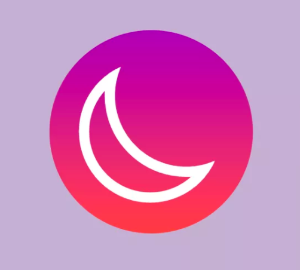

## Social-App

This is a Social Network application built with Laravel and VueJS using TDD and Laravel Dusk Tests.

## About

This application is created using completely the TDD approach.

##### To run all tests just use the command:
    `/project/path$ ./vendor/bin/phpunit --testdox`
and
    
    `/project/path$ php artisan dusk --testdox`
    
For Dusk test: Start the .env.dusk.local file instead of 

    `php artisan serve` 
    
use:

    `php artisan serve --env=dusk.local`
    
#### Installation

- `git clone https://github.com/Bcryp7/social-network.git`
- `composer install`
- `npm install`
- `cp .env.example .env`
- `php artisan key:generate`
- Set DB credentials in .env file
- Set Pusher credentials in .env file
- `npm run watch`
- `php artisan serve`
- Enjoy!

## Contributing
Thank you for considering contributing to the Social Network App!
Feel free to create a PR for any changes you consider appropriate and it will be open to discussion.
Please include appropriate tests.

## Security Vulnerabilities
If you discover a security vulnerability within Social Network App!, please create a PR so I can address it as soon as possible.

## License
You can do whatever you want with the Code or maybe you can help me make this project even better.